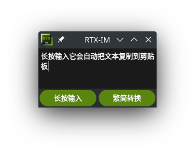

# 低延迟离线语音输入法



长按即可输入，它会自动把输出文本复制到剪贴板，并在鼠标光标位置粘贴，同时在文本框中显示

点击繁简转换按钮，文本框中的内容会进行繁简转换，并将转换结果复制到剪贴板

本项目基于python3.10开发，要求有桌面环境，推荐kde。windodows下也可以运行

# 安装
首先确保系统已安装alsa-utils，用于录音，例如archlinux下安装：
```shell
pacman -S alsa-utils
```

创建虚拟环境并安装requirements.txt所需的依赖
```shell
python3.10 -m venv venv

# 安装依赖
venv/bin/pip install -r requirements.txt
```

## 在运行之前，我们需要导出ONNX模型

### 命令行用法
```shell
funasr-export ++model=paraformer ++quantize=false ++device=cpu
```

### Python
```python
from funasr import AutoModel

model = AutoModel(model="paraformer", device="cpu")

res = model.export(quantize=False)
```

之后根据导出ONNX模型的目录，更改Qt_ONNX_windows.py文件的model_dir，确保一致，以便正常加载模型

# 运行

使用虚拟环境运行Qt_ONNX_windows.py即可，全局热键默认为 Scroll Lock 键，长按即可输入（全局热键在X11和windodows下可用，Wayland不可用，不过可以用kde快捷键之类的特定桌面实现）

如果需要更换样式请使用Qt_ONNX_windows_style.py，它使用了更加现代的样式
#

我的另一种语音输入法的方案，使电脑可以直接使用手机的输入法输入
https://github.com/pofice/linux-voice-input-method-2

funASR出处
https://github.com/alibaba-damo-academy/FunASR
